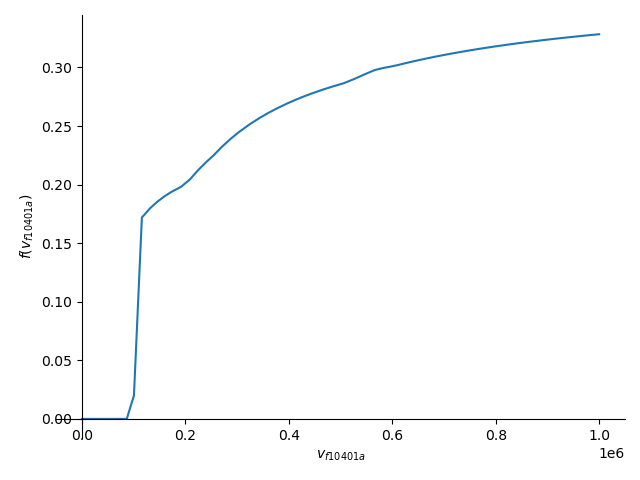

# sympy-tax
Using sympy to compute tax as an equation.

Disclaimer: This project does not provide tax advice. Use at your own risk.

This project is currently only a PoC. Please edit the source code to meet your
needs.

## License

GPL v3

## Usage

Install dependencies: `pip3 install -r requirements.txt`

In `input.yml`, enter your information.

Run the script: `python3 main.py [arguments]`, where arguments are:
* `-f`: change filing status, e.g. single, mfj, hoh, mfs, qss.
* `-c`: override default consts file of `input.yml`.
* `-i`: override default input file of `consts/2024.yml`.
* `--plot`: Plot some kind of tax rate graph.

Example: `python3 main.py -f mfj -c my_input.yml`

## Demo

Run the program using the example input (single, income $1000000, W-2 withheld
$330000).

```
$ p main.py -f single --plot
v_f1040_1z = v_f1040_1a + v_f1040_1b + v_f1040_1c + v_f1040_1d + v_f1040_...
           = 1000000

v_f1040_9 = v_f1040_1a + v_f1040_1b + v_f1040_1c + v_f1040_1d + v_f1040_...
          = 1000000

v_f1040_11 = -v_f1040_10 + v_f1040_1a + v_f1040_1b + v_f1040_1c + v_f1040...
           = 1000000

v_f1040_12 = 14600
           = 14600

v_f1040_14 = 14600 - v_f1040_13
           = 14600

v_f1040_15 = Max(0, -v_f1040_10 + v_f1040_13 + v_f1040_1a + v_f1040_1b + ...
           = 985400

v_f1040_16 = Piecewise((0.22*Max(0, -v_f1040_10 + v_f1040_13 + v_f1040_1a...
             if Max(0, -v_f1040_10 + v_f1040_13 + v_f1040_1a + v_f1040_1b + ...
           = 322785.750000000

v_f1040_18 = v_f1040_17 + Piecewise((0.22*Max(0, -v_f1040_10 + v_f1040_13...
             if Max(0, -v_f1040_10 + v_f1040_13 + v_f1040_1a + v_f1040_1b + ...
           = 322785.750000000

v_f1040_21 = v_f1040_19 + v_f1040_20
           = 0

v_f1040_24 = Max(0, v_f1040_17 - v_f1040_19 - v_f1040_20 + Piecewise((0.2...
             if Max(0, -v_f1040_10 + v_f1040_13 + v_f1040_1a + v_f1040_1b + ...
           = 322785.750000000

v_f1040_25d = v_f1040_25a + v_f1040_25b + v_f1040_25c
            = 330000

v_f1040_32 = v_f1040_27 + v_f1040_28 + v_f1040_29 + v_f1040_31
           = 0

v_f1040_33 = v_f1040_25a + v_f1040_25b + v_f1040_25c + v_f1040_26 + v_f10...
           = 330000

v_f1040_34 = v_f1040_25a + v_f1040_25b + v_f1040_25c + v_f1040_26 + v_f10...
             if (Max(0, -v_f1040_10 + v_f1040_13 + v_f1040_1a + v_f1040_1b +...
           = 7214.25000000000

v_f1040_37 = -v_f1040_25a - v_f1040_25b - v_f1040_25c - v_f1040_26 - v_f1...
             if (Max(0, -v_f1040_10 + v_f1040_13 + v_f1040_1a + v_f1040_1b +...
           = undefined

Piecewise((0.22*Max(0, x - 14600) - 4947.0, (Max(0, x - 14600) >= 100000) & (Max(0, x - 14600) < 100525)), (0.24*Max(0, x - 14600) - 6957.5, (Max(0, x - 14600) >= 100525) & (Max(0, x - 14600) < 191950)), (0.32*Max(0, x - 14600) - 22313.5, (Max(0, x - 14600) >= 191950) & (Max(0, x - 14600) < 243725)), (0.35*Max(0, x - 14600) - 29625.25, (Max(0, x - 14600) >= 243725) & (Max(0, x - 14600) < 609350)), (0.37*Max(0, x - 14600) - 41812.25, Max(0, x - 14600) >= 609350))/Max(0, x - 14600)
$ 
```

Tax rate graph when changing the 1000000 income and keeping all other inputs the
same:



